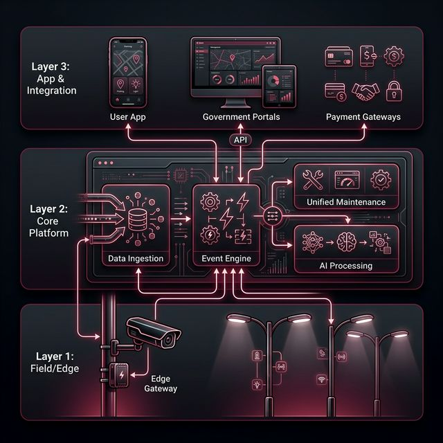
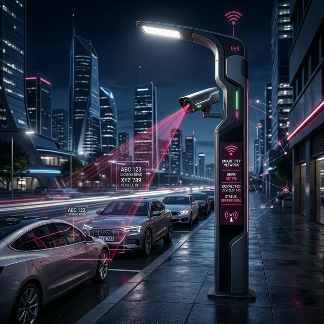

# Transight: Smart Parking & Incident Management Presentation

> [!NOTE]
> This is the finalized 8-slide pitch tailored for the Eastern Province PPP, combining the detailed business proposition with clear technical architecture and visual aids.

````carousel
---
### Slide 1: Eastern Province Smart Parking — Our Solution
**A city-scale parking operating system. *Built for this concession.***

Eastern Province needs a parking platform that works without kiosks, collects payment automatically, keeps every camera and streetlight running — and stays relevant for 15 years. We are proposing exactly that. Not an off-the-shelf product. A platform built together from the ground up right here.

**Key Highlights:**
- **Camera-first** — no kiosks, no wardens
- **Automatic payment collection**
- **One team runs cameras + streetlights**
- **Saudi-ready on day one**
- Scales to **75,000 spaces**
- Designed for **15 years**

**Pilot & Scale Metrics:**
- **15** Cameras in the pilot
- **1,500** Smart lighting poles in the pilot
- **75,000** Spaces at full scale
- **15 yrs** Concession term

<!-- slide -->
### Slide 2: How the system works
**From a car arriving to a payment collected — automatically, every time**

Five things happen in sequence every time someone parks. No warden. No ticket machine. No manual steps.

1. 📸 **Camera reads the number plate** as the car enters.
2. ⚡ **System logs the parking session** and calculates the fee.
3. 📱 **Driver is notified** and pays via app, STC Pay or mada.
4. ✅ **Paid → Session marked compliant.** (No pay → Incident generated automatically).
5. 🔧 **System stays healthy** — faults fixed automatically.

**The Big Picture:**
- **🏙️ In the street:** Smart cameras on existing streetlight poles read plates entering/leaving. No new poles or separate power.
- **☁️ In the platform:** A record opens, charge calculates, and driver is notified in under 2 seconds.
- **🖥️ For the operator:** Live map of bays, queue of unpaid incidents with photos, and a maintenance view for all cameras/streetlights.



<!-- slide -->
### Slide 3: The Smart Pole Advantage
**Our cameras cost less, work better, and are easier to maintain.**



Because our streetlight poles are already powered and connected, installing a camera on them is much simpler than running new infrastructure.

**What sits on each smart pole:**
- **💡 The streetlight:** Upgraded with SmartTec. Reports its own health and supplies stable 24/7 electricity to the camera.
- **📸 The ANPR camera:** Mounted to cover 10-28 bays depending on street width.
- **🖥️ A small pole computer:** Processes the image directly on the pole, sending only results to the platform in under 1 second.

**How we make sure the camera works with any brand:**
Camera technology will improve over 15 years. If our platform only works with one brand, replacing hardware means rebuilding the system. We prevent this by using a **Translator** that converts *any* camera's output (Brand A, Brand B, Future Brand) into a standard format. Our Platform only sees the same standardized data.

<!-- slide -->
### Slide 4: The Payment Journey
**Every riyal owed is either collected or turned into an enforceable record.**

**Step by step — what happens for every vehicle:**
1. 📸 **Camera reads plate:** Session opens, calculates fee.
2. 📲 **Driver gets notification:** One tap link to pay via STC Pay, mada, or card.
3. ✅ **Paid** (driver gets receipt, can extend time via app) **OR** ⏳ **Grace Window** (short extra window before action).
4. ⚠️ **Incident created automatically:** If unpaid, violation record is generated with photo, ready for EP enforcement.

**Saudi Payments & Government connections:**
We designed the system so it never depends on one specific wallet.
- **Payment Gateway:** STC Pay, mada, Apple Pay all route through one Payment Gateway. The Core Platform remains unchanged.
- **Government connections handled right:** During the pilot:
  - STC Pay, mada & App notifications are **Live**.
  - Absher vehicle identity/National identity checks are **Simulated** (Live in production).
  - Municipal enforcement is **Manual for now**, moving to **Fully automated** in production.

<!-- slide -->
### Slide 5: Unified maintenance: one team, every asset
**A broken camera and a failed streetlight go into the same system**

Managing these as two separate operations doubles costs and creates coverage gaps.
- **Automatic Alerts:** Camera offline, Lamp failed, or Connection lost — all trigger automatic alerts.
- **One Maintenance System:** All faults enter one queue.
- **Work order raised in < 1 min:** Assigned based on asset, location, priority, and best contractor skills.
- **Contractor App:** Navigate, repair, take photo, close job (stops SLA timer).
- **Single Dashboard:** Operator sees live status of all assets.

**Why this matters:** Every hour a camera is offline is a parking bay we cannot charge for. Unified maintenance protects revenue. 

**Repair Targets:** 
- Camera (completely offline): Fix within 8 hrs
- Streetlight (completely dark): Fix within 12 hrs
- Communications (connection lost): Fix within 6 hrs

<!-- slide -->
### Slide 6: Built for 15 years and the whole Gulf
**The platform grows. The cameras get replaced. The contract keeps running.**

**1. Hardware refresh is a purchase order, not a technology crisis:**
Camera tech improves every 4-5 years. Over 15 years, we replace hardware twice:
- Years 1-6: Pilot cameras validated & scaled.
- Years 7-11: First refresh (translator updated; core unchanged).
- Years 12-15: Second refresh.

**2. Saudi Arabia first — the Gulf next:**
Saudi-specific logic (STC Pay, Absher, Arabic UI) is isolated. Adding Bahrain or UAE is a *configuration exercise*, not a development project. The core platform runs unchanged.

**3. All data stays in Saudi Arabia:**
- Hosted in Riyadh (AWS).
- 99.95% Availability.
- 7 years of evidence kept securely.
- NCA Saudi cybersecurity compliant.

<!-- slide -->
### Slide 7: The pilot plan: test everything before committing
**The pilot is not a demonstration. Every phase produces a decision.**

- **Phase 0 (Weeks 1-6):** Lay foundation. Confirm 15 camera positions, set up cloud in AWS Riyadh, build simulations.
- **Phase 1 (Weeks 7-16):** Does the camera system work? (Must hit >95% accuracy daytime, >90% night).
- **Phase 2 (Weeks 17-26):** Does the full payment journey work? (500 real users, aim for >65% payment conversion, <48h incident closure).
- **Phase 3 (Weeks 27-30):** Lock in the full rollout design. Sign off production plan for 75,000 spaces.

**What we answer during the pilot:**
1. **Which camera covers the most bays per pole?** (Tested across 3 street types).
2. **Will EP drivers use the app to pay?** (Measured with real users).
3. **Can the EP ops team manage this system?** (Real operators run Phase 2).

<!-- slide -->
### Slide 8: Why this is the right answer
**Six reasons this is the only platform built for this concession.**

1. Designed specifically around this EP concession — not adapted to it.
2. Payment is the centre of the system, not a feature bolted on.
3. The SmartTec poles give us an unmatched unit cost advantage.
4. Hardware replacement in year 7 is planned and seamless.
5. The pilot produces real decisions backed by real data.
6. Saudi Arabia is Market 1, and the platform easily scales to the whole Gulf.

**What we need Transight to bring to the meeting:**
- **Platform architecture** (Core vs Country adapters).
- **Camera design & the translator pattern**.
- **Parallel development approach**.
- **Payment orchestration design**.
- **Maintenance workflow** (lighting + cameras).
- **15-year hardware assumptions** & phased pilot workplan.
````
